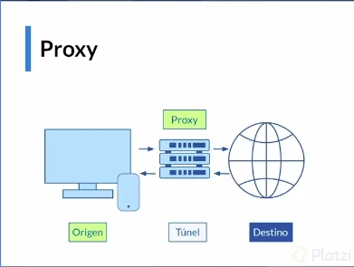

# Curso de Vue.js 3

## ¿Qué es Vue?

_Librerías: Son una serie de herramientas provistas para que puedan ser usadas y facilitar el desarrollo_

_Frameworks: Estos no solo te proveen las herramientas para trabajar, sino que también te dicen cómo trabajarlas._

Vue es un **framework** _progresivo_, ya que te permite agregar capas, a medida que tu aplicación vaya creciendo puedes agregar más y más capas que necesites.

**Declarative Rendering**: Es con la que Vue trabaja todo, se encarga de conectar la información con la presentación. La información son todos los datos de tu aplicación, la presentación es la encargada de mostrar la información al usuario.

**Components**: Separan y encapsulan partes de la aplicación, son como pequeños legos que puedes usar para armar poco a poco la página.

## Declarative rendering con Vue.js

Una característica potente que posee Vue, y que tiene un impacto alto en su rendimiento y escalabilidad es su forma eficiente de actualizar el DOM a través del DOM Virtual. Esto sucede en el proceso de renderizado de nuestros componentes. Pero ¿qué rayos es DOM y DOM Virtual? Veamos que significa cada cosa. Cuando nos referimos a DOM o Modelo de objetos de documento nos referimos a una estructura de árbol, que contiene una serie de nodos, cada uno de estos nodos representa un elemento de nuestro HTML, un nodo puede tener nodos hijos. Imaginemos un blog, donde existen una serie de artículos, el contenedor de nuestro blog sera un node, y cada articulo representa un nodo hijo. El DOM tiene una serie de métodos que nos permiten acceder y cambiar el arbol completo o una parte de él, pero estos métodos tienen un gran problema y es que mientras mas grande es el DOM usarlos conlleva un mayor esfuerzo y esto afecta el rendimiento de nuestras aplicaciones. Por este motivo usamos el DOM Virtual que es una forma de representar nuestro DOM con objetos de Javascript, la razón de esto es que trabajar con objetos de javascript es mucho mas sencillo y eficiente. Por tanto, por cada nodo de nuestro DOM podemos crear un nodo virtual.

Vue aprovecha los nodos virtuales para convertirlos en un nodo del DOM. Vue esta pendiente de los cambios que ocurren en cada nodo, cuando ocurre un cambio verifica su nuevo estado con el anterior y decide si debe o no actualizar el DOM. Si se necesita actualizar el DOM, Vue solo actualiza los nodos que sufrieron cambios y el resto permanece intacto, esto es muy importante porque hace que nuestras aplicaciones reaccionen rápidamente y actualicen el contenido, ademas de esto Vue esta pendiente de aquellos nodos con propiedades reactivas.

## Reactividad en vue.js

Lo primero que debemos saber es que la reactividad es un paradigma, una forma caracteristica de actuar ante cierta situcación. Que un sistema sea reactivo implica una mayor flexibilidad, un bajo acoplamiento, lo que facilita el desarrollo y escalabilidad, pues son sistemas susceptibles a los cambios.

Existen una serie de caracteristicas que deben tener los sistemas reactivos, veamos cuales son:

- **Responsive**: Poseen una capacidad de respuesta, donde los problemas pueden detectarse rapido y ser tratados de forma eficiente para que asi el sistema puede responder de forma eficiente, esto permite darle a los usuarios una mayor confianza y asi incentivar el uso del sistema.

- **Resiliente**: Todo sistema reactivo debe funcionar incluso cuando existan errores, debe mantenerse receptivo. Al estar los sistemas compuestos por componentes, las fallas se presentan de forma independiente dentro de cada uno de ellos, lo que permite que ciertan partes puedan fallar y recuperarse sin comprometer el funcionamiento total del sistema.

- **Escalable**: El sistema debe estar en capacidad de crecer sin problemas, es receptivo a carga de trabajo que cambian en cualquier momento. Debe tener la capacidad de replicar o fragmentar componentes y distribuir las entradas entre todos ellos. Estos sistemas generalente admiten algoritmos de escalado.

- **Arquitectura basada en mensajes**: Los sistemas reactivos se caracterizan por tener una comunicación a traves del paso de mensajes asincronicos, donde existe una transparencia en la ubicación del destinatario. Esto permite tener un mejor flujo de mensajes, donde se supervisa la cola de mensajes que existe en el sistema. Estas comunicaciones son impulsadas por eventos.

## ¿Qué es un Proxy?

Los servidores proxy generalmente se usan como un puente entre el origen y el destino de una solicitud. En nuestra imagen, puedes ver que la computadora necesita pasar por el servidor proxy para acceder a Internet, y este es uno de los usos comunes de los servidores proxy.

### ¿Para qué sirve un servidor proxy?

En este caso, el proxy puede cumplir algunas de las siguientes funciones:

- Control de acceso: es posible que los administradores del servidor proxy permitan que ciertos usuarios tengan o no acceso a Internet a través de restricciones en su propio inicio de sesión o direcciones IP, proporcionando al entorno una capa adicional de protección.
- Filtrado de contenido: al estar en el medio del camino, el servidor también permite, o no, el acceso a ciertos sitios. Entre las reglas que se pueden aplicar están aquellas para bloquear sitios web específicos, pudiendo llegar a bloquear categorías completas.

Imagínate a un proxy como un INTERMEDIARIO, en el ámbito de redes, tú puedes conectarte desde tu computadora a un servidor intermedio, y ese servidor intermedio puede conectarse a cualquier sitio web al que quieras entrar. De este modo, quien se conecta al sitio web es ese servidor intermedio y este mismo es quien te manda a ti la información de dicho sitio web, de esa manera tienes una conexión un poco más segura, y en este caso ese servidor intermedio es un proxy.
